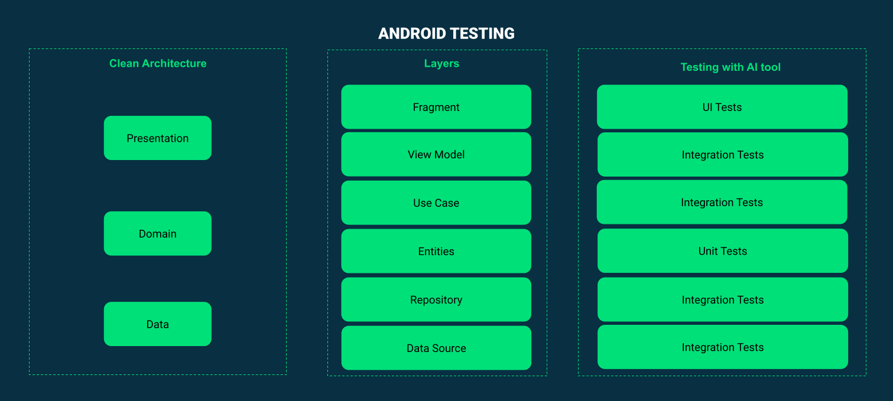

<h1 align="center">Android Testing with ChatGPT 🧪</h1>

<div align="center">
        
        
</div>

Welcome to Android Testing with ChatGPT! The goal of this repository is to implement the use of an AI tool like "ChatGPT" in the testing process, adhering to the current standards used by an Android engineering team.

Here is a guide that will give you an introduction to the terminology used in this repository: Android Testing, ChatGPT, Context, Generate Similar Functions, Custom Instructions.
- **[Guidelines]()**

This contains all topics to help you find what you are looking for quickly. I hope I can help you.

## 🤖 Android Testing
<div align="center">
        
        
</div>

## 🏠 Base Project
For the examples in the repository, we used the android-showcase project by Igor Wodja as a foundation. This project was chosen because it adheres to the best practices in the industry up to the present day. Although the application is small, it could be considered as an enterprise-type application due to the comprehensive architecture of its core.
- **[android-showcase by @igorwojda](https://github.com/igorwojda/android-showcase)**

## 🧩 Integration Test
Integration tests are responsible for verifying interactions and connection points among various components, modules, and services within an Android application.

### Guidelines
1. Keep tests small, individual, and focused.
2. Function names should use interpolated strings, respecting spaces, following the structure: Given - When - Then.
3. The function structure should follow the AAA pattern (Arrange-Act-Assert).
4. The class name should use the Test suffix.
5. Tools used: JUnit and Mockito or JUnit and MockK.
6. Declare global variables using the @Mock annotation for Mockito or @MockK for MockK, with variable names suffixed with "mock."
7. Use runTest to carry out the execution of asynchronous processes.
8. If you need to generate data for tests, use the structure of Martin Fowler's Object Mother pattern.

### Parent Class
Our example implementation has a base class called BaseTest, from which all test classes will inherit, conforming to the structure built within this class.
```
@ExperimentalCoroutinesApi
abstract class BaseIntegrationTest {
    @get:Rule
    val testInstantTaskTaskExecutorRule = InstantTaskExecutorRule()

    @Before
    fun setup() {
        val testDispatcher = StandardTestDispatcher()
        Dispatchers.setMain(testDispatcher)
        MockKAnnotations.init(this)
    }

    @After
    fun tearDown() {
        Dispatchers.resetMain()
        unmockkAll()
    }

    abstract fun build()
}
```

## 🚀 Generate Test Functions
To create similar functions from a sample base class, we will use the concept of Seed and Generator from the realm of pseudo-random numbers, explained in detail in the Guidelines.

### 🛠️ Structure
We will rely on two structures:

#### **Using the context of ChatGPT**.
Seed
```
You should take this class as the base for future kotlin classes, keeping the structure:
[Example Base Class]

Base Class: The Kotlin test class [Name Example Base Class] extends [Name Parent Class].
[Parent Class]
```

Generator
```
Role: Behaving as an Android expert, we'll conduct unit testing for a Kotlin class.

Testing Framework: We will use the library [MockK or Mockito].

Testing Guidelines:
- Keep tests individual and focused.
- Using string interpolation, spaces, and descriptive names for test functions.
- Incorporating the parts "Given," "When," and "Then" in test function names.
- Follow the AAA pattern for test functions.
- Declare global variables using the @Mock annotation, with variable names suffixed by "mock."
- The test must use "runTest" as coroutine builder.

Kotlin Class to Test:
[Class or function to test]
```

#### **Using custom instructions from ChatGPT**.

Seed: What would you like ChatGPT to know about you to provide better responses?
```
You should take this class as the base for future kotlin classes, keeping the structure:
[Example Base Class]
```

Generator: How would you like ChatGPT to respond?
```
Role: Behaving as an Android expert, we'll conduct unit testing for a Kotlin class.

Testing Framework: We will use the library [MockK or Mockito].

Base Class: The Kotlin test class extends [Name Parent Class].
[Parent Class]

Testing Guidelines:
- Keep tests individual and focused.
- Using string interpolation, spaces, and descriptive names for test functions.
- Incorporating the parts "Given," "When," and "Then" in test function names.
- Follow the AAA pattern for test functions.
- Declare global variables using the @Mock annotation, with variable names suffixed by "mock."
- The test must use "runTest" as coroutine builder.
```
### 🧪 UseCase

### 🧪 Repository

## 🚀 Generate Test Data
Use the structure of the Object Mother pattern to generate test data. Add the suffix "Mother" to the class name, for example, CreateAdditionalCardMother. The term "Mother" comes from Domain-Driven Design (DDD) and symbolizes the birth or creation of objects. In the context of Martin Fowler's Object Mother pattern, these classes are used to centralize the creation of test objects and provide default values to simplify test data setup. It is advisable to use this class for objects that exceed 10 lines of code.

### 🛠️ Using the context of ChatGPT.

### 🧪 Repository

## 🚦 Wrap Up
If you have an idea to improve the map, feel free to discuss it in the issues.

## ⚠️  Disclamer
Use the content of this repository at your discretion and with caution.

## Find this project useful? :heart:

Support it by joining __[stargazers](https://github.com/FahedHermoza/android-architecture-roadmap/stargazers)__ for this repository. :star: <br>
And __[follow](https://www.linkedin.com/in/fahedhermoza/)__ me for my next creations! 🤩

License
-------

    Copyright 2023 Fahed Hermoza

    Licensed under the Apache License, Version 2.0 (the "License");
    you may not use this file except in compliance with the License.
    You may obtain a copy of the License at

    http://www.apache.org/licenses/LICENSE-2.0

    Unless required by applicable law or agreed to in writing, software
    distributed under the License is distributed on an "AS IS" BASIS,
    WITHOUT WARRANTIES OR CONDITIONS OF ANY KIND, either express or implied.
    See the License for the specific language governing permissions and
    limitations under the License.